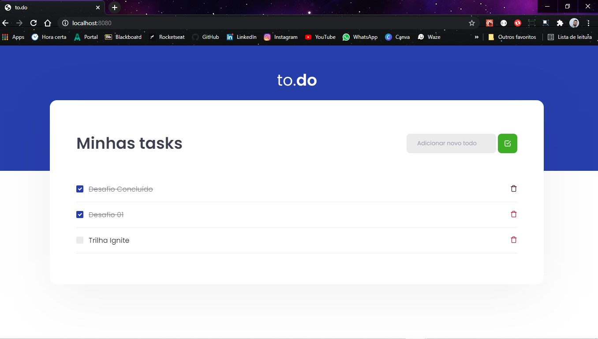

# <h1 align="center">Ignite Challenge (Trail ReactJS - Chapter I)</h1>

<h2 align="center">Challenge 01 - React Concepts (Rocketseat)</h2>

## 📑 Sobre o Desafio

Nesse desafio, foi criado uma aplicação para colocar em prática alguns conceitos do ReactJS.
  Essa será uma aplicação onde o seu principal objetivo é uma pequena aplicação de atividades a fazer, para treinar um pouco mais sobre manipulação do estado no React. :octocat:

  

É uma aplicação tipo To.Do, onde foi colocado em prática os conceitos para:

* 1º: Adicionar uma nova tarefa ✔
* 2º: Remover uma tarefa ✔
* 3º: Marcar e desmarcar uma tarefa como concluída ✔

<h2 align="center">to.do</h2>

  <kbd></kbd>

<h3 align="center">#Turma_01 - Front-end Developer N/A0110629</h3>

  <kbd></kbd>

  <kbd></kbd>

#

<h3 align="center">Licença</h3>
<h6 align="center">Esse projeto está sob a licença MIT. Veja o arquivo LICENSE para mais detalhes.</h6>

  
  

---

  
    

